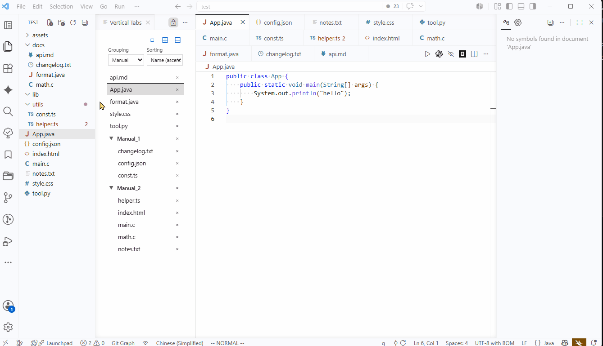

# Vertical Tabs in Editor Area

```html
<p align="center">
  <a href="README.md">English</a> ·
  <a href="README.zh-CN.md">简体中文（规范源）</a> ·
  <a href="docs/README.zh-TW.md">繁體中文</a> ·
  <a href="docs/README.ja.md">日本語</a> ·
  <a href="docs/README.ko.md">한국어</a> ·
  <a href="docs/README.es.md">Español</a> ·
  <a href="docs/README.fr.md">Français</a> ·
  <a href="docs/README.de.md">Deutsch</a> ·
  <a href="docs/README.ru.md">Русский</a>
</p>
```

Display an always-visible <mark>vertical tab bar</mark> on the <mark>left side of the editor area</mark>, without occupying the primary or secondary sidebars.

The interface layout is as follows:

```text
Primary Sidebar | Vertical Tab Bar | Editor Area | Secondary Sidebar
```

## Demo



## Why This Extension

VS Code uses a horizontal tab bar by default. When many files are open, tab names are easily truncated, making it unintuitive to find and switch between files.

Many vertical tabs extensions place the tab list in the primary sidebar, but the primary sidebar also needs to display the file explorer, search, source control, extensions, and other features.

When users switch sidebar functions, the vertical tab list is hidden along with it.

This extension places the vertical tab bar on the left side of the editor area, so it remains visible even when switching between other functions in the primary sidebar.

## Who Is It For

- Frequently working with many files open simultaneously
- Have enough horizontal screen space
- Don't want vertical tabs to occupy the primary sidebar

## Features

- **Display vertical tabs on the left side of the editor area**
- Multi-language support (i18n)
- Tab groups, including automatic and manual grouping (by file type, by parent directory, or follow VS Code horizontal tab bar)
- Tab sorting: manual, by name, by time
- Show/hide the vertical tab bar
- Basic tab operations:
	- Drag to group
	- Batch close
	- Expand all
	- Collapse all
	- Right-click to pin tabs and tab groups
	- Batch move (use Shift key for multi-select)
- When group type is "parent directory", dragging a file to another group moves the actual file on disk

## Quick Start

- Search for "Vertical Tabs in Editor Area" in the VS Code extension marketplace and install it. The extension identifier is `laikang287.vertical-tabs-in-editor-area`
- Restart VS Code
- Find the `VERTICAL TABS` icon in the VS Code activity bar, click it to open the view. Use Show/Hide to toggle the vertical tab bar
- Note 1: You can drag the `VERTICAL TABS` view into other frequently used areas of the activity bar for convenience
	- See the demo GIF above
- Note 2: It is recommended to keep VS Code's tab wrapping disabled when using this extension:

```json
{
  "workbench.editor.wrapTabs": false
}
```

## How to Switch the Interface Language

Configure `verticalTabs.language` to switch the extension's language. The default value is `auto`.

## How It Works

Upon startup, the extension creates a Webview and places it in a separate editor group on the far left of the editor area.

This Webview is used to display the vertical tabs.

The extension then uses VS Code's editor group locking feature to lock that group, preventing subsequently opened files from entering the editor group occupied by the vertical tab bar.

## Notes

1. This project used AI programming tools during development to assist with code writing, testing, and documentation
2. Documentation is based on README.zh-CN; other language versions are AI-translated
3. The Simplified Chinese documentation is the primary maintained version of this project

## License

MIT License - see [LICENSE](LICENSE)

## Manual Installation

- Find the latest `.vsix` file in the releases directory of the [vscode-vertical-tabs-in-editor-area](https://github.com/laikang287/vscode-vertical-tabs-in-editor-area/tree/main/releases) GitHub repository and download it
- Open VS Code, go to the Extensions view in the activity bar, click the three-dot menu in the top-right corner of the sidebar, and select "Install from VSIX..."
